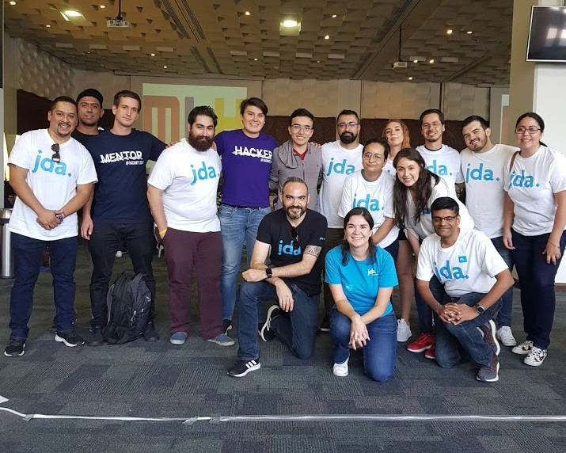

# **HackMty 2019 1st place JDA Challenge**
Repository with the code for HackMty2019

#### Solutions: 
- JDA: Machine learning regression based model to predict future sales with scikit-learn
- Konfio: Progressive web app to monitor financial elements of a business

## **1st Place on JDA Challenge**  
Website for JDA: https://seawar741.github.io/HackMty2019/Presentacion_JDA/

## **JDA**
### Objective 
To convince investors to fund your project of buying out “Cerveceria Teotihuacan” by presenting accurately forecasted sales quantity for the next three months based on the historical data provided to you.

### Description
You and your roommate just graduated from ITESM and are looking to start a business together. Coincidentally, both of you are craft beer enthusiasts and are aware of the increasing market for craft beer in Monterrey. 
You, being an ITC graduate, and your friend being an IIA graduate, decided this would be a great opportunity to pursue your entrepreneurship dreams, while at the same time appealing to your passion.
Cerveceria Teotihuacan is a small brewery in decline; located in the outskirts of the city, it produces different kinds of beer and distributes them to several stores in Nuevo Leon. Instead of starting a business from scratch, you wish to buy and ramp up Cerveceria Teotihuacan.
First you need to gather enough funds to acquire the business, and to do this you need to sell the idea to investors, providing evidence of the future demand for craft beer.
After repeated talks with the owners of Cerveceria Teotihuacan, you get access to their historical records, which contain information about the daily sales quantity and the different external factors that influence beer sales on any given day. 
You compile all relevant data in dataset input_data_train.csv, which contains historical data from 2012/1 to 2013/6.
Given this dataset, predict the sales quantity for the following three months. Provide the predicted sales quantity in the file input_data_pred.csv.

#### Requirements
-	Provide a data sheet containing the forecast for the next three months of data. 
-	It is recommended you use Machine Learning as you will also be graded based on scalability. Besides selling the idea to investors, this tool will serve for your demand planning activities in the future. 
-	Use Python as a means of processing to raw data to obtain the final output.
-	Be creative, a well-presented web-UI is always better than providing just the raw data. 
-	The mean squared error (MSE) will be checked for the quality of the predictions.  

### **Team 01001100**
- @SeaWar741 Juan Carlos Garfias Tovar
- @LuiggiFdz Luis Alberto Fernández
- @edvilme Eduardo Villalpando Mello

### **Team Photo**

